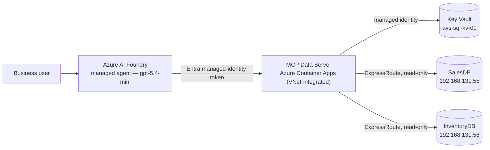
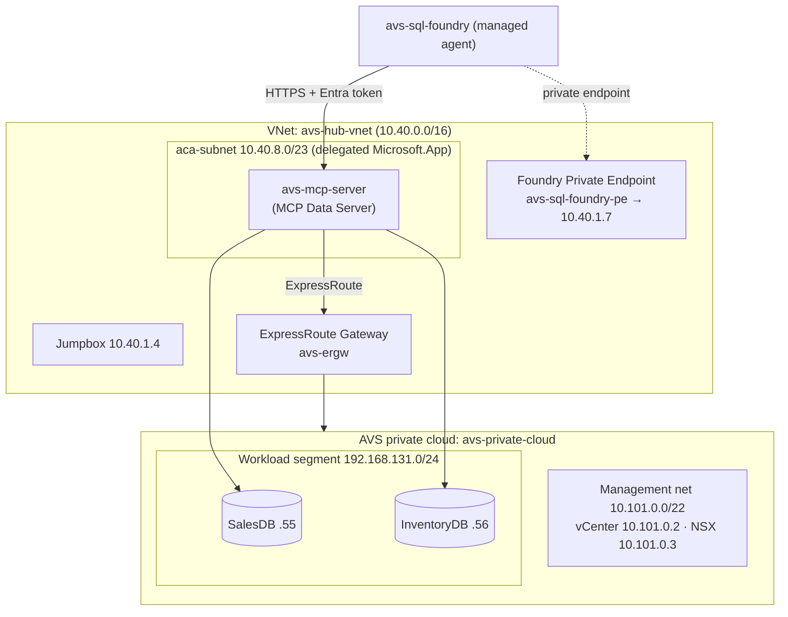
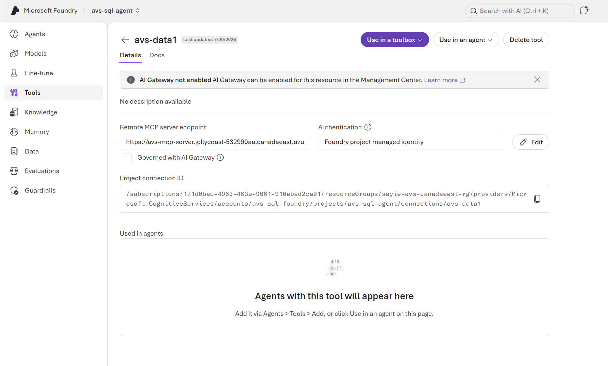
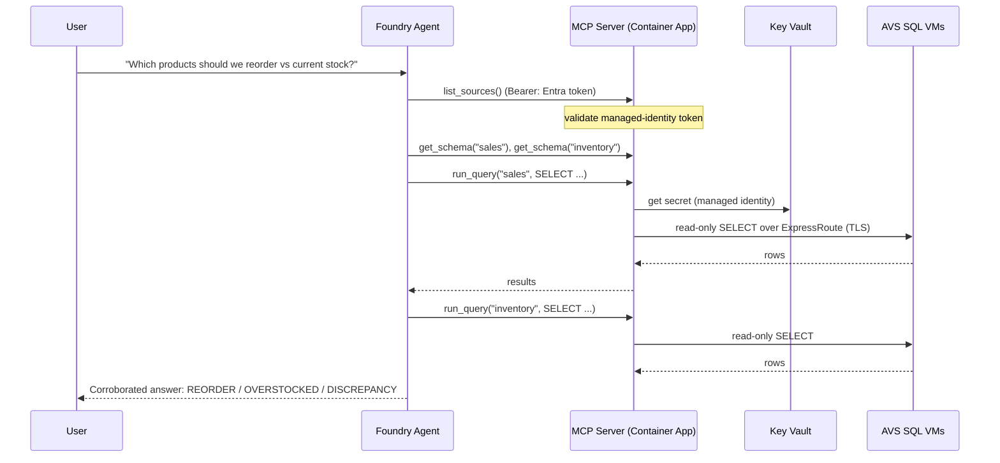
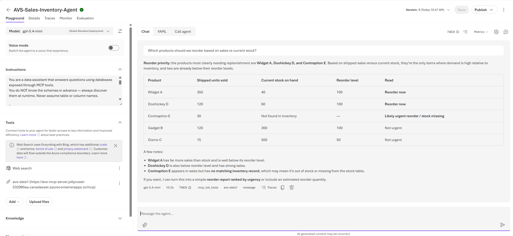
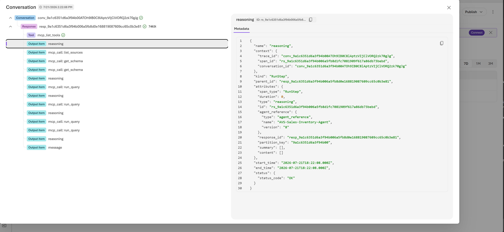

# Bring Azure AI to your private Azure VMware Solution workloads

*Query the databases running inside your AVS private cloud in natural language — securely, read-only, and without moving your data or exposing it to the internet.*

Organizations move their VMware estates to **Azure VMware Solution (AVS)** so they can modernize on their own terms — lifting and shifting mission-critical applications into Azure without rewriting them. But that same "don't change it" advantage has a side effect: the systems that hold your most valuable data — core databases and line-of-business applications — run on private networks inside the private cloud, out of reach of the Azure-native AI services that could bring them to life.

Azure AI Foundry, Microsoft Copilot, and AI agents live in the Azure control plane and, by default, reach only public endpoints. So when teams set out to "add AI everywhere," the workloads in AVS are often the exception — not because the data isn't valuable, but because it's private by design.

This post shows a pattern that closes that gap: a **managed Azure AI Foundry agent that answers natural-language questions by querying private databases running on VMs inside an AVS private cloud** — with **no data leaving your network, no credentials in code, and read-only access enforced end to end.**

> **Get the code:** the full deployment kit — Bicep/ARM templates, the MCP server, and a one-command deploy script — is on GitHub at [**AVS-workload-agent**](https://github.com/nivasn_microsoft/AVS-workload-agent).

## Solution overview



Three ideas carry the design:

1. **Model Context Protocol (MCP)** gives the agent a clean, tool-based contract to data (`list_sources`, `get_schema`, `run_query`).
2. **A VNet-integrated Azure Container App** is the bridge that can legally see *both* worlds — Azure and the private AVS network over ExpressRoute.
3. **Managed identity end-to-end** — no passwords in code or config; the agent presents an Entra token, the server pulls DB credentials from Key Vault.

---

## Reference architecture

The reference deployment runs in a single Azure region (Canada East), with the Azure resources in one resource group alongside the AVS private cloud.

| Component | Resource | Type |
|---|---|---|
| AVS private cloud | `avs-private-cloud` | `Microsoft.AVS/privateClouds` |
| MCP server | `avs-mcp-server` | `Microsoft.App/containerApps` |
| Container Apps env | `avs-mcp-env` | `Microsoft.App/managedEnvironments` |
| AI Foundry account | `avs-sql-foundry` | `Microsoft.CognitiveServices/accounts` |
| Foundry project | `avs-sql-foundry/avs-sql-agent` | `.../accounts/projects` |
| Container registry | `avssqlacr` | `Microsoft.ContainerRegistry/registries` |
| Secrets | `avs-sql-kv-01` | `Microsoft.KeyVault/vaults` |
| Network | `avs-hub-vnet` (10.40.0.0/16) | `Microsoft.Network/virtualNetworks` |
| ExpressRoute gateway | `avs-ergw` (+ `-conn`) | `virtualNetworkGateways` / `connections` |
| Foundry private endpoint | `avs-sql-foundry-pe` (+ 3 privatelink DNS zones) | `privateEndpoints` |
| Jump host | `Jumpbox` (10.40.1.4) | `Microsoft.Compute/virtualMachines` |
| Logs | `avs-sql-logs` | `OperationalInsights/workspaces` |

**Data VMs** (inside the AVS private cloud, NSX segment `avs-workload-01`, 192.168.131.0/24):

| VM | IP | Database |
|---|---|---|
| SQL VM #1 | `192.168.131.55` | `SalesDB` (Products, Customers, Orders) |
| SQL VM #2 | `192.168.131.56` | `InventoryDB` (Products, Stock) |

---

## Network topology

The bridge works because the Container Apps subnet routes to the AVS private cloud over ExpressRoute, while Foundry is reachable privately via a private endpoint.



Key points:
- The **MCP server** runs in a delegated **`aca-subnet`** and reaches the workload segment over ExpressRoute.
- **Foundry** has a **private endpoint** (`avs-sql-foundry-pe`) with three `privatelink` DNS zones (`cognitiveservices`, `services.ai`, `openai`) so the jumpbox/portal can reach it privately; inbound public access can be locked to an IP allow-list.
- The **managed agent's tool call** to the MCP server is an outbound HTTPS call carrying an Entra token.

---

## The data bridge: a Model Context Protocol server

A small Python service (FastMCP, `streamable-http`) exposes three read-only tools. It is engine-agnostic (SQLAlchemy) and pulls credentials from Key Vault at runtime.

```python
@mcp.tool()
def list_sources() -> str:
    """List the databases across the AVS workloads and what each contains."""

@mcp.tool()
def get_schema(source: str) -> str:
    """Return tables and columns for a source (call list_sources first)."""

@mcp.tool()
def run_query(source: str, query: str) -> str:
    """Run ONE read-only SELECT and return up to the source's row cap."""
```

**Guardrails:** only `SELECT` / `WITH`, single statement, DML/DDL keywords blocked, results row-capped. The agent gets to *read and reason* — never to mutate.

**Deployment:** containerized (ODBC Driver 18 + `msodbcsql18`), pushed to `avssqlacr`, and run on the VNet-integrated `avs-mcp-env`. The Container App has a **system-assigned managed identity** with **Key Vault Secrets User** on `avs-sql-kv-01`.

**Config-driven catalog** (`sources.yaml`) — onboarding a database is config, not code:

```yaml
sources:
  sales:
    type: mssql
    connection: { host: 192.168.131.55, port: 1433, database: SalesDB }
    auth: { kind: sql, username: agentreader, secret: sql-agentreader-password }
    governance: { allow_schemas: [dbo], max_rows: 200 }
  inventory:
    type: mssql
    connection: { host: 192.168.131.56, port: 1433, database: InventoryDB }
    auth: { kind: sql, username: agentreader, secret: sql-agentreader-password }
    governance: { allow_schemas: [dbo], max_rows: 200 }
```

---

## The managed agent in Azure AI Foundry

The agent lives entirely in **`avs-sql-foundry` / project `avs-sql-agent`** (model `gpt-5.4-mini`). It's configured with:
- **Instructions** that force a schema-first workflow (discover sources → read schema → write read-only SQL → corroborate).
- An **MCP tool** pointing at the Container App's `/mcp` endpoint, authenticated with **Microsoft Entra / Project Managed Identity**.

Generic, source-agnostic instructions (the productizable version) tell the agent to *discover* structure at runtime rather than hard-coding any schema — so the same agent works against any databases behind the MCP server.


*Figure 1: The managed agent in Azure AI Foundry, with the private MCP data server attached as a tool and authenticated via managed identity.*

---

## How a question becomes an answer



---

## Security and governance

- **No secrets in code** — SQL credentials live in `avs-sql-kv-01`; the server fetches them via its managed identity (`DefaultAzureCredential` → `SecretClient`).
- **Entra managed-identity auth** from the agent to the server — no shared keys, tokens auto-rotate.
- **Private connectivity** — the server reaches AVS over ExpressRoute; the SQL VMs are never exposed to the internet; Foundry is fronted by a private endpoint.
- **Read-only guardrails** — only `SELECT` is allowed; writes/DDL blocked; result sets capped.
- **Least-privilege caller lock** — the server accepts tokens **only** from the Foundry project's managed identity.

---

## The payoff: corroboration across silos

The value isn't "query a table" — it's **corroboration** a single database can't do. Two databases share a `ProductID`; the agent queries **both** and joins them itself:

> **Widget A** — sold 500, stock 40 (below reorder 50) → **REORDER NOW**
> **Gizmo C** — high stock, low sales → **OVERSTOCKED**
> **Contraption E** — in Sales, missing from Inventory → **DISCREPANCY**


*Figure 2: A natural-language question answered from two private AVS databases, with reorder, overstock, and discrepancy flags.*


*Figure 3: The run trace — every tool call and query is visible and auditable (`list_sources` → `get_schema` → `run_query` on each source).*

The same pattern generalizes: *claims vs policy*, *orders vs fulfillment*, *tickets vs assets*.

---

## Extending it to any data source

The single-purpose server becomes reusable with four moves:
1. **SQLAlchemy** → one code path for SQL Server, PostgreSQL, MySQL, Oracle (source `type` selects the dialect).
2. **Config-driven catalog** → onboard a database with YAML + a Key Vault secret.
3. **Governance layer** → per-source allow/deny schemas, row caps, (optional) column masking.
4. **Connector interface** → SQL today; files / REST / NoSQL later behind the same three tools.

Adding a Postgres VM, for example, requires **no `mcp_server.py` changes** — add `psycopg2-binary` to requirements, a source block (`type: postgresql`, `allow_schemas: [public]`), and a Key Vault secret, then rebuild.

---

## How it's deployed

```powershell
# Build + push the MCP image
$acr = az acr list -g avs-sql-rg --query "[0].name" -o tsv   # avssqlacr
az acr build --registry $acr --image avs-mcp:v4 .

# Deploy to the VNet-integrated Container Apps environment
az containerapp update -n avs-mcp-server -g avs-sql-rg `
  --image "$acr.azurecr.io/avs-mcp:v4"

# Grant the app's managed identity access to Key Vault (Secrets User)
# Store the read-only SQL credential
az keyvault secret set --vault-name avs-sql-kv-01 `
  --name sql-agentreader-password --value '<password>'
```

In the Foundry portal: create the agent (model `gpt-5.4-mini`), attach the MCP tool (`https://avs-mcp-server.<env>.canadaeast.azurecontainerapps.io/mcp`, **Microsoft Entra / Project Managed Identity**), and test in the playground.

**Deploy it yourself.** The entire bridge is packaged as an open, reusable kit on GitHub — [**AVS-workload-agent**](https://github.com/nivasn_microsoft/AVS-workload-agent) — with a Bicep template (and a compiled ARM JSON equivalent), a parameters file, and a one-command deploy script. It provisions the delegated subnet, the container registry, Key Vault (with the read-only secret), the VNet-integrated Container Apps environment and MCP server, and the managed-identity role assignments — optionally including the Azure AI Foundry account and model deployment. You point it at your existing VNet (the one connected to your AVS private cloud) and supply a read-only database credential; the script builds and pushes the MCP image and wires up the app. All that remains is creating the read-only database login and attaching the MCP tool to your agent in the portal.

---

## What's next

- **Meet users where they are** — surface the agent in **Microsoft Teams or Microsoft 365 Copilot** through a lightweight, VNet-integrated API.
- **One agent, many databases** — the same pattern points at SQL Server, PostgreSQL, MySQL, or Oracle with configuration, not code.
- **Beyond relational data** — extend the same tool contract to file shares, REST APIs, and other sources.

---

## Bringing it together

With a managed agent in Azure AI Foundry, a lightweight bridge on VNet-integrated Azure Container Apps, and private connectivity over ExpressRoute, data that used to be "off-limits to AI" becomes conversational — while staying **inside your network, read-only, and credential-less**, using the same identity and governance model you already rely on across Azure.

For organizations on Azure VMware Solution, this reframes what AVS is for: not just where your VMware workloads *run*, but where they become **AI-accessible** — securely and in place.

*Reference architecture: managed Azure AI Foundry agent → MCP server on VNet-integrated Azure Container Apps → ExpressRoute → private SQL databases in Azure VMware Solution. Read-only, credential-less, private, and auditable.*
